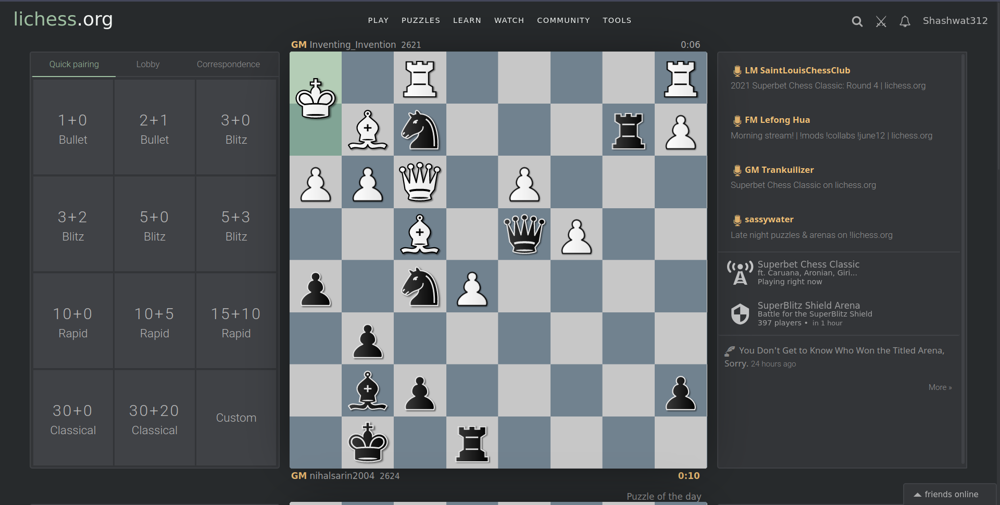

# Prettier Lichess

A modern theme for lichess

## How to Install

1. Download [Stylus](https://github.com/openstyles/stylus). Available for [Chrome](https://chrome.google.com/webstore/detail/stylus/clngdbkpkpeebahjckkjfobafhncgmne), [Firefox](https://addons.mozilla.org/firefox/addon/styl-us/) and [Opera](https://addons.opera.com/extensions/details/stylus/)
2. Click [here](https://github.com/TheTrio/prettierlichess/raw/master/styles.user.css) or on the install button above.
3. Click on install style when prompted

## About

This is a fork of the amazing work done by [Noah Semus](https://github.com/noahsemus) and others on [PrettierLichess](https://github.com/prettierlichess/prettierlichess), a browser extension for making Lichess look more modern. 

I loved their work, but found installing an extension just to style a website overkill. Which is why I created a [Stylus](https://github.com/openstyles/stylus) compatible user style for PrettierLichess. This way you can have an amazing lichess experience without having to install another extension. 

Do note that the extension has some more advanced styling options, including the ability to install community themes. If you need that functionality, I recommend using their extension instead. 

## How to customize

You can customize the site colors from within the Stylus extension. Just click on the extension icon, and you'll find a settings icon next to "PrettierLichess". Click on that to configure your own theme. 
